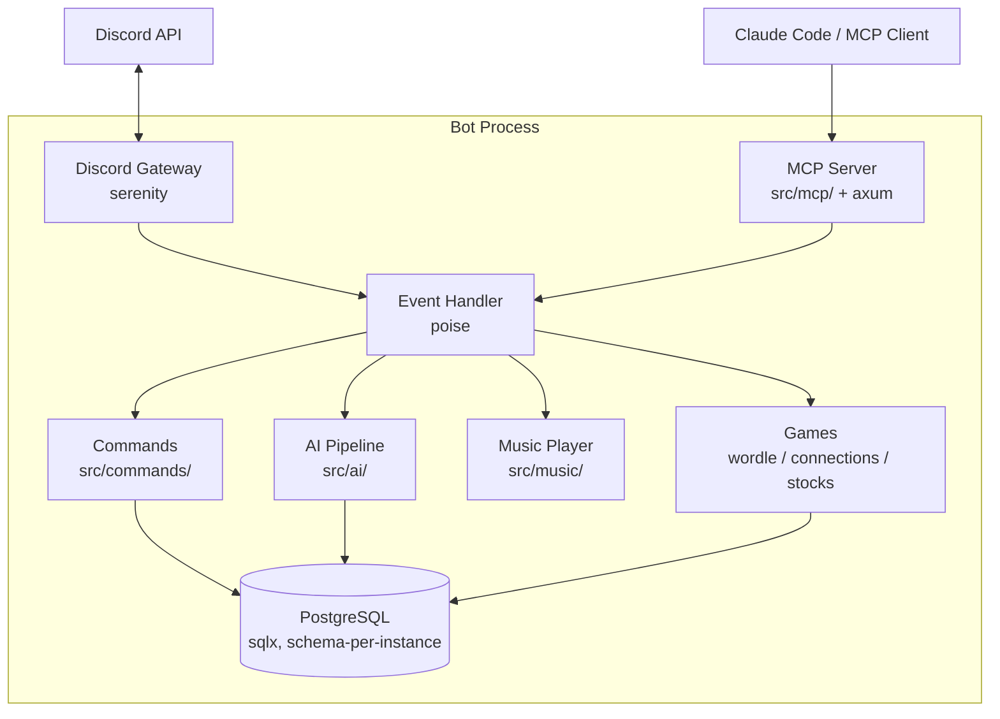

# discord-bot-rs

**A multi-instance Discord bot framework written in Rust.**

[](https://github.com/MrMcEpic/discord-bot-rs/actions/workflows/ci.yml)
[](https://mrmcepic.github.io/discord-bot-rs/)
[](LICENSE)
[](https://rustup.rs)
[](https://github.com/MrMcEpic/discord-bot-rs/pkgs/container/discord-bot-rs)

---

discord-bot-rs is a batteries-included Discord bot framework you can self-host. Run one bot or fifty from a single Rust binary, each with its own personality, database schema, and feature set. Ships with AI chat, music, games, moderation, a Minecraft module, and a Model Context Protocol server for programmatic Discord management from Claude Code or any MCP client.

<!-- Screenshots will be added post-launch. -->
<!--  -->
<!--  -->
<!--  -->
<!--  -->

## Features

### Multi-instance, one binary

One Rust binary runs any number of bot instances simultaneously, each with its own Discord application, personality file, database schema, and feature flags. Adding a bot is copying a directory and editing three text files.

```bash
cp -r instances/example instances/mybot
# Edit instances/mybot/.env and instances/mybot/config.toml
INSTANCE_DIR=./instances/mybot docker compose up -d
```

### AI chat with real tool use

@mention the bot and it replies with a DeepSeek-powered conversation shaped by the personality file you wrote. Gemini is the fallback provider when DeepSeek errors. The AI can invoke tools: web search, moderation actions, music control, user confirmations.

### Music with passthrough audio

yt-dlp and ffmpeg produce a 256 kbps OGG/Opus stream that [songbird](https://github.com/serenity-rs/songbird) plays without transcoding. Very low CPU. Supports YouTube, SoundCloud, Bandcamp, and anything yt-dlp knows about. Interactive button controls, queue with loop and shuffle, auto-leave on empty voice channel.

### Built-in games

Daily Wordle, Connections (group-by-category), and virtual stock trading with real-time Finnhub data. Each game has its own schema isolation per instance, so running two bots doesn't share state.

### Minecraft integration

Link Discord accounts to Minecraft accounts via `!m verify`. Optional donator role sync polls your Tebex-backed MC server and applies Discord roles based on tier. Optional real-time chargeback alerts ship an interactive staff embed the moment a player charges back.

### MCP server for Claude Code

An embedded Model Context Protocol server exposes 22 Discord management tools. Plug Claude Code into `http://localhost:9090/mcp` and manage guilds, channels, roles, and members from an AI assistant. A companion mcp-gateway service routes tool calls across multiple bot instances when you run more than one.

## Quick Start

```bash
git clone https://github.com/MrMcEpic/discord-bot-rs.git
cd discord-bot-rs
cp -r instances/example instances/mybot
cp instances/mybot/.env.example instances/mybot/.env
# Edit instances/mybot/.env with your Discord token + API keys
INSTANCE_DIR=./instances/mybot docker compose up -d
```

The full ten-minute walkthrough is in [docs/getting-started/quickstart.md](https://mrmcepic.github.io/discord-bot-rs/book/getting-started/quickstart.html). First-timers who want the hand-held version should start with the [First Bot Tutorial](https://mrmcepic.github.io/discord-bot-rs/book/getting-started/first-bot-tutorial.html).

## Architecture



Each bot instance is one process with its own shared `Data` struct holding a PostgreSQL pool, configuration, AI state, per-guild music players, and more. Commands reach state through `ctx.data()`. Events flow Discord → serenity → poise → handlers → database. See [docs/architecture/](https://mrmcepic.github.io/discord-bot-rs/book/architecture/) for the deep dive, including multi-instance topology, the AI pipeline, the music pipeline, the MCP gateway, and the database schema.

## Configuration

Configuration is split across three files per instance:

| File              | What lives here                                     | Documented in                                                                                            |
| ----------------- | --------------------------------------------------- | -------------------------------------------------------------------------------------------------------- |
| `.env`            | Secrets, tokens, API keys, database connection      | [docs/configuration/environment-variables.md](https://mrmcepic.github.io/discord-bot-rs/book/configuration/environment-variables.html) |
| `config.toml`     | Bot identity, command prefix, feature flags         | [docs/configuration/instance-config.md](https://mrmcepic.github.io/discord-bot-rs/book/configuration/instance-config.html)              |
| `personality.txt` | AI system prompt (free-form prose)                  | [docs/configuration/personality.md](https://mrmcepic.github.io/discord-bot-rs/book/configuration/personality.html)                      |

The full configuration model, including how instances are isolated and how to run more than one, is in [docs/configuration/](https://mrmcepic.github.io/discord-bot-rs/book/configuration/).

## Feature Reference

- [AI Chat](https://mrmcepic.github.io/discord-bot-rs/book/features/ai-chat.html) — DeepSeek + Gemini, @mention conversations with tool use
- [Music](https://mrmcepic.github.io/discord-bot-rs/book/features/music.html) — yt-dlp + ffmpeg passthrough, queue controls, auto-leave
- [Wordle](https://mrmcepic.github.io/discord-bot-rs/book/features/games-wordle.html), [Connections](https://mrmcepic.github.io/discord-bot-rs/book/features/games-connections.html), [Virtual Stocks](https://mrmcepic.github.io/discord-bot-rs/book/features/games-stocks.html) — built-in games with per-instance state
- [Moderation](https://mrmcepic.github.io/discord-bot-rs/book/features/moderation.html) — tempban, unban, banlist, nuke
- [Auto-Role Promotion](https://mrmcepic.github.io/discord-bot-rs/book/features/auto-role.html) — activity-based role advancement
- [Member Join](https://mrmcepic.github.io/discord-bot-rs/book/features/join-features.html) — join role + AI welcome
- [Minecraft Module](https://mrmcepic.github.io/discord-bot-rs/book/features/minecraft-verify.html) — account verify, donator sync, chargeback alerts
- [MCP Server](https://mrmcepic.github.io/discord-bot-rs/book/features/mcp-server.html) — programmatic Discord management for Claude Code

## Documentation

Full documentation: **<https://mrmcepic.github.io/discord-bot-rs/>**

Highlights:

- [Getting Started](https://mrmcepic.github.io/discord-bot-rs/book/getting-started/) — install, quickstart, first-bot tutorial, setup verification
- [Configuration](https://mrmcepic.github.io/discord-bot-rs/book/configuration/) — env vars, config.toml reference, secrets management
- [Features](https://mrmcepic.github.io/discord-bot-rs/book/features/) — deep dive per feature
- [Architecture](https://mrmcepic.github.io/discord-bot-rs/book/architecture/) — how it's built, with diagrams
- [Development](https://mrmcepic.github.io/discord-bot-rs/book/development/) — codebase tour, adding a command, contributing workflow
- [Reference](https://mrmcepic.github.io/discord-bot-rs/book/reference/) — command list, MCP tool catalog, FAQ, glossary

## Contributing

Contributions welcome. Read [CONTRIBUTING.md](CONTRIBUTING.md) for the dev setup, code style, and PR workflow. The [Codebase Tour](https://mrmcepic.github.io/discord-bot-rs/book/development/codebase-tour.html) is the best place to start if you're new to the project. Security issues should follow [SECURITY.md](SECURITY.md) — please do not open public issues for vulnerabilities.

## License

**AGPL-3.0-or-later.** See [LICENSE](LICENSE) for the full text.

In plain English: you can run, modify, and distribute this bot freely. If you run a modified version as a public service (including a hosted Discord bot others interact with), you must publish your changes under the same license. The copyleft extends over the network, which is the "A" in AGPL.

If this restriction is a problem for your use case, let's talk — open an issue.

## Acknowledgements

This project stands on the shoulders of excellent open-source work:

- [serenity](https://github.com/serenity-rs/serenity) and [poise](https://github.com/serenity-rs/poise) — Discord API and command framework
- [songbird](https://github.com/serenity-rs/songbird) — voice engine
- [sqlx](https://github.com/launchbadge/sqlx) — async SQL toolkit
- [rmcp](https://github.com/modelcontextprotocol/rust-sdk) — Rust MCP SDK
- [axum](https://github.com/tokio-rs/axum) and [tower](https://github.com/tower-rs/tower) — HTTP server stack
- [yt-dlp](https://github.com/yt-dlp/yt-dlp) and [ffmpeg](https://ffmpeg.org/) — audio pipeline
- [DeepSeek](https://www.deepseek.com/) and [Google Gemini](https://ai.google.dev/) — language models
- [Finnhub](https://finnhub.io/) — market data
- [Anthropic](https://www.anthropic.com/) — the Model Context Protocol spec and Claude Code
