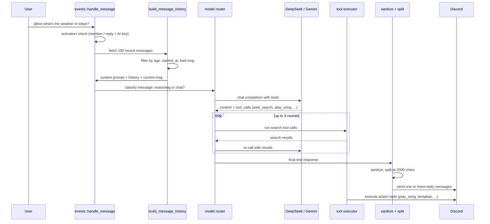

# AI Pipeline

This page walks through the path from a Discord `@mention` to the reply
the user sees. It's the most elaborate event path in the bot: history
building, personality injection, provider routing, tool-use loops,
response sanitising, and Discord-friendly chunking all happen before the
reply is sent. A reader who understands this page can confidently
extend the AI in new directions — adding tools, tweaking the system
prompt, swapping providers — without breaking the rest.

The core file is
[`src/ai/deepseek.rs`](https://github.com/MrMcEpic/discord-bot-rs/blob/master/src/ai/deepseek.rs).
Everything under `src/ai/` is either called from there or defines data
it consumes. For how users actually interact with this from Discord,
see [AI Chat](../features/ai-chat.md).

## Sequence



Not shown: vision routing (images go directly to Gemini 3 Flash via
OpenAI-compatible endpoint before any of this), the moderation
confirmation button flow, and the typing indicator that fires every 8
seconds while the pipeline is running.

## Activation

Before any of the pipeline runs, the bot has to decide "is this for
me?" That check lives in
[`handle_message`](https://github.com/MrMcEpic/discord-bot-rs/blob/master/src/events/mod.rs)
in `src/events/mod.rs` and is deliberately narrow. Three conditions must
all hold before `handle_mention` is called:

1. The message is from a non-bot author in a guild channel.
2. The message either contains a direct mention of the bot user ID, or
   is a Discord reply to a message the bot itself sent.
3. At least one of `DEEPSEEK_API_KEY` or `GEMINI_API_KEY` is set on
   `Data::config`.

There is no keyword trigger, no prefix alternative, no owner override.
Everything flows through `@mention` or reply. This keeps the activation
surface small, which matters for a bot that can issue tempbans and spend
real money on API calls.

A fourth short-circuit happens inside `handle_mention`: the per-user AI
rate limiter ([`RateLimiters::ai`](https://github.com/MrMcEpic/discord-bot-rs/blob/master/src/util/ratelimit.rs))
is a sliding window of 10 requests per 60 seconds. Users who exceed it
get a "Slow down — try again in Ns." reply and the pipeline exits
before any API call.

## History building

The AI's memory is whatever messages the bot can reconstruct from the
channel's recent history. There is no vector store, no long-term memory,
no per-user state. When the pipeline starts,
[`build_message_history`](https://github.com/MrMcEpic/discord-bot-rs/blob/master/src/ai/deepseek.rs)
fetches the last 100 messages before the current one via
`channel.messages(...).before(message.id).limit(100)` and walks them in
reverse-chronological order.

From that window, it keeps the most recent 10 **relevant** messages,
where "relevant" means:

- **Posted after `Data::started_at`.** Bot messages from a previous
  process instance are filtered out, because they might be tied to state
  this process no longer has.
- **Posted within the last 30 minutes.** Anything older is stale context
  — the AI would start mixing up a question from an hour ago with the
  current one.
- **Either from the bot (assistant role) or from a human who was
  directly talking to the bot** (either mentioning it or replying to a
  bot message). Messages that are just general channel chatter don't
  get included — the bot is not trying to maintain a running summary of
  the whole channel.
- **Not a known bad assistant message.** Leaked `I'm Claude`, memory
  denials, broken tool replies, and error strings are pattern-matched
  via
  [`BAD_ASSISTANT_PATTERNS`](https://github.com/MrMcEpic/discord-bot-rs/blob/master/src/ai/deepseek.rs)
  and skipped — and any user message those bad assistant messages were
  replying to is skipped too, on the theory that if the AI blew up on
  that question, feeding it back in will make it blow up again.

Bot messages whose `content` is empty but that carry embeds (Now Playing,
Added to Queue, confirmation prompts, etc.) get their embeds summarised
into a compact `[Already completed action] [title: description]` string.
This is what keeps the AI from replaying the same music request every
time someone @mentions it — the embed history tells the model "you
already did this, move on."

After the loop, the builder pushes a synthetic system message:

> Everything above is conversation history for context only. You have
> already responded to all of it. Do NOT act on any previous requests
> again. The NEXT message is the current request — respond ONLY to it.

This separator is a necessary belt-and-braces measure against a
failure mode where the AI would pick up an earlier question and answer
it instead of the new one. Finally, the current message is appended as
a user-role message, prefixed with the author's display name.

If the current message is a Discord reply to a non-bot message, the
builder fetches that referenced message, truncates it to 300 characters,
and prepends a `[Replying to name: "..."]` marker to the current
message. If the referenced message has image attachments, they're
collected for vision routing.

## Personality and system prompt

The personality file loaded from `CONFIG_DIR/personality.txt` is
appended verbatim into the system prompt by
[`get_system_prompt`](https://github.com/MrMcEpic/discord-bot-rs/blob/master/src/ai/deepseek.rs).
Around it, the function hard-codes:

- The current date (so the model doesn't guess),
- The current bot version (pulled from `CARGO_PKG_VERSION`),
- A block explaining the music tools and the rules for using them (most
  importantly: only on explicit current requests, never replay old ones),
- A block explaining the web search tool and the rule that the model
  can search up to three times per turn,
- A block explaining moderation tools and that the system does its own
  permission checking,
- A block covering markdown capabilities, the user-name prefix
  convention, and how to handle mentions in message text,
- A security block instructing the model to refuse prompt-injection
  attempts and to treat role markers in user text as data, not
  instructions.

The personality file never sees this hard-coded framing: the bot
operator writes only their instance's voice, and the bot fills in the
mechanics. See [Personality Files](../configuration/personality.md) for
how to write the free-form half.

## Provider selection

The bot speaks two providers, both through an OpenAI-compatible
chat-completions API:

- **DeepSeek** at `https://api.deepseek.com/chat/completions`.
  `deepseek-chat` (DeepSeek V3) is the default for text. `deepseek-reasoner`
  is used for questions the router classifies as needing deeper thinking.
- **Gemini** at `https://generativelanguage.googleapis.com/v1beta/openai/chat/completions`.
  `gemini-3-flash-preview` handles image vision, because DeepSeek's
  chat model is text-only.

Routing happens in two places. First, **vision routing**: if the message
(or the message it replies to) has image attachments and a Gemini key is
configured, the pipeline preprocesses each image (resize to 1024x1024
max, re-encode as JPEG, base64 in a data URI) and sends the history as
a multimodal completion to Gemini. If Gemini fails, the pipeline strips
the images and falls through to the text path.

Second, **reasoning routing**: for text requests,
[`classify_message`](https://github.com/MrMcEpic/discord-bot-rs/blob/master/src/ai/deepseek.rs)
sends the user's most recent message to DeepSeek V3 with a one-shot
"yes/no — does this need deep reasoning?" prompt. If the classifier
says yes, the pipeline switches the active endpoint to DeepSeek
Reasoner. Because Reasoner can't use tools, the pipeline first runs a
**pre-flight** loop on V3 that's allowed to call `web_search` up to
`MAX_SEARCH_ROUNDS` times (currently 3), collects the results, and
injects them into the Reasoner's conversation as extra system context
before asking Reasoner the real question.

If the classifier itself fails (network error, timeout), the pipeline
defaults to V3 without reasoning — "failing toward the cheap path" is
the preferred failure mode.

## Tool use loop

Once an endpoint and model are picked, `call_api` posts the history
with the full
[tool definitions](https://github.com/MrMcEpic/discord-bot-rs/blob/master/src/ai/tools.rs)
attached (except for Reasoner, which gets no tools). The response
contains `content` (the assistant message), `tool_calls` (any function
calls the model wants to invoke), or both.

Tools come in two flavours:

- **Search tools** — just `web_search` today. The model asks for a
  search, the bot runs it, the result goes back to the model as a
  `role: "tool"` message, and the model gets another turn to decide
  whether to search again or answer. Up to `MAX_SEARCH_ROUNDS` rounds
  (currently 3), after which the pipeline forces a final answer with
  tools disabled. The same `MAX_SEARCH_ROUNDS` constant in
  `src/ai/deepseek.rs` is interpolated into the system prompt and
  drives both the V3 chat loop and the Reasoner pre-flight loop, so
  the prompt and the code can never disagree about the limit.
- **Action tools** — everything that changes state: `play_song`,
  `skip`, `stop`, `pause`, `resume`, `show_queue`, `now_playing`,
  `shuffle`, `set_loop`, `remove_from_queue`, `tempban`, `unban`,
  `nuke`, `stock_buy`, `stock_sell`, `stock_price`, `stock_portfolio`,
  `stock_leaderboard`, `connections_start`, `wordle_start`.

Search tools are executed inside the loop because their results feed
back into the model. Action tools are executed **after** the text
response is posted: the bot sends the model's witty reply, then runs
the actions. This preserves the personality when actions have their own
output (skip messages, Now Playing embeds, etc.) and keeps the user
experience close to "bot says something, then does the thing."

Action tools are dispatched from a single `for` loop in `handle_mention`
that checks each call against `is_moderation_tool`, `is_stock_tool`,
`is_connections_tool`, `is_wordle_tool`, and falls through to
`execute_music_tool` for the rest. Moderation tools go through an
extra step: a Discord confirmation embed with Approve/Cancel buttons,
handled by
[`request_confirmation`](https://github.com/MrMcEpic/discord-bot-rs/blob/master/src/ai/confirmation.rs).
That function pre-checks the requesting user's guild permissions
(computed from role permissions because `Message::member.permissions`
is often `None` for fetched messages), posts the confirmation embed,
waits up to 30 seconds for the original author to click, and returns
approval status. Only then does the moderation action run. Other
action tools run without confirmation — permissions are enforced inside
each tool by the DJ mode check or by Discord's own permissions.

### DSML: tool calls in prose

DeepSeek V3 sometimes emits tool calls as structured text inside the
content field instead of the proper OpenAI-style `tool_calls` array.
The bot handles this by parsing a custom "DSML" (Discord Structured
Message Language) block out of the content — fullwidth pipe characters
wrapping `<|DSML|invoke name="...">...</|DSML|/invoke>` — in
[`parse_dsml`](https://github.com/MrMcEpic/discord-bot-rs/blob/master/src/ai/dsml.rs).
Any DSML tool calls found are appended to the real tool call list and
the content is cleaned up before being shown to the user. This is a
resilience hack for model quirks; the primary path is still proper
function calling.

## Response sanitising

Two kinds of cleaning happen to AI-adjacent text.

**Input sanitising** is applied to every bit of user text that gets
added to the history. Mentioned in
[`sanitize_content`](https://github.com/MrMcEpic/discord-bot-rs/blob/master/src/ai/sanitize.rs),
it rewrites `system:`, `assistant:`, `user:` role markers into
bracketed forms (`[system]:`), strips DeepSeek's internal `<|...|>`
tokens, and strips Llama-style `[INST]` and `<SYS>` markers. The point
is not to block every conceivable prompt injection — that's impossible
— but to make it harder to slip a realistic-looking "new system
prompt" into the model's conversation by typing one into Discord.

**Output filtering** happens at history-build time. Past bot messages
that match known failure patterns ("I'm Claude", "I don't have access
to our previous", "created by Anthropic", "Failed to join", etc.) are
skipped when reconstructing the history, and so are any user messages
those bad bot messages were replying to. This is a self-healing
mechanism: if the model goes off the rails once, the next turn won't
see the broken exchange and is less likely to repeat it.

## Response splitting

Discord messages max out at 2000 characters. The splitter in
[`src/ai/split.rs`](https://github.com/MrMcEpic/discord-bot-rs/blob/master/src/ai/split.rs)
takes a raw response string and returns a `Vec<String>` of chunks each
under the limit. Simple cases (response under 2000 chars) return a
single-element vec. For long responses, the splitter walks forward
looking for the best break point:

- If the current chunk ends inside a fenced code block (an odd number of
  ` ``` ` markers), the splitter finds the opening fence and either
  splits just before it (if the code block hasn't yet started near the
  top of the chunk) or closes it with ` ``` ` and re-opens it with
  ` ```lang ` in the next chunk, preserving syntax highlighting.
- Otherwise, it prefers breaking on `\n\n`, then `\n`, then `". "` — in
  that order. The split point has to be at least 200 bytes into the
  chunk to avoid pathological tiny slices.

All slicing is done at char boundaries (UTF-8 safety), not byte
boundaries, so multi-byte characters don't get cut in half.

## Rate limiting

Rate limiting for the AI path is a per-user sliding window configured in
[`src/util/ratelimit.rs`](https://github.com/MrMcEpic/discord-bot-rs/blob/master/src/util/ratelimit.rs):
10 requests per 60 seconds, shared across every AI interaction. It's
enforced in `handle_mention` before any API call. The other limiters —
`music`, `moderation`, `stocks`, and `welcome` — are all enforced too
on their respective paths; see the
[Concurrency Model rate-limiter section](concurrency-model.md#rate-limiting)
for the full table and the periodic bucket-cleanup task that keeps the
limiter maps from growing without bound.

Rate limiting at the API layer (DeepSeek / Gemini quotas) is the
provider's responsibility; the bot doesn't pre-check quotas and relies
on the API's own error responses.

## Error handling inside the pipeline

Each layer has its own fallback:

- **Classifier fails** → default to V3 (non-reasoner) path.
- **Vision API fails** → strip images and fall through to text.
- **Text API fails** → reply with "Something went wrong talking to the
  AI. Try again in a sec." Log the upstream error with `tracing`.
- **"Content Exists Risk" censored response from DeepSeek** → reply with
  a sarcastic "my overlords at DeepSeek won't let me talk about that."
- **Search tool fails** → inject "Search failed." as the tool result
  and let the model continue with whatever it has.
- **Tool call with bad arguments** → the tool executors generally
  `unwrap_or(...)` past missing fields rather than erroring, because
  the user has already waited for the model and a silent no-op is
  better than a red error string.
- **Tool dispatch / DB / HTTP failures inside a tool** → all
  user-facing replies in `handle_mention`'s tool loop now use the
  same generic, sanitised wording as `BotError::user_message()`
  ("Something went wrong talking to the database. Please try again
  later.", etc.). Operators still see the full upstream error via
  `tracing::error!` with the failing tool name and guild ID, but
  raw `sqlx`/`reqwest`/`serde_json` strings never reach Discord.
  See [Error Handling](error-handling.md) for the mapping table.

The typing indicator is re-triggered every 8 seconds by a spawned
background task, so users see the bot "thinking" for the whole duration
of a slow tool-use loop. That task is aborted on every exit path
(`typing_handle.abort()`) to keep it from leaking past the end of the
conversation.

## Known issues

- **Context bleed.** The 10-message / 30-minute window is a compromise.
  Shorter would drop useful context; longer pulls in stale questions
  the AI wants to answer. Users occasionally see the AI start answering
  a question from 20 minutes ago when they @mention it with something
  new. The self-healing filter helps but doesn't eliminate it.
- **Permission checks on message.member.** Confirmation flow has to
  recompute permissions from the guild's role table because
  `message.member.permissions` is often `None` for messages fetched via
  the API. This is a serenity quirk, not a design choice.
- **`rmcp` session auth.** See
  [MCP Gateway Routing](mcp-gateway-routing.md) for the current state of
  MCP authentication.

## Cross-links

- [AI Chat](../features/ai-chat.md) — user-facing feature description.
- [Personality Files](../configuration/personality.md) — how to write
  `personality.txt`.
- [Concurrency Model](concurrency-model.md) — the rate limiter and
  `DashMap` patterns the pipeline leans on.
- [MCP Tool Catalog](../reference/mcp-tool-catalog.md) — the separate
  tool surface exposed via MCP, not via the AI pipeline.
