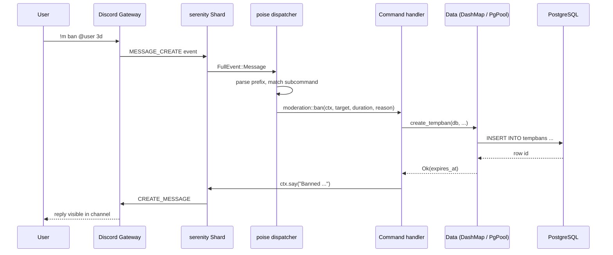

# Data Flow

This page follows a single Discord event from its arrival on the gateway
to the response going back out, touching every layer the bot passes it
through on the way. The goal is to give you enough mental model to know
where to look when something misbehaves and where to add new behaviour
when you're extending the bot.

The two main paths are **commands** (a message starting with the
configured prefix that matches a `!m` subcommand) and **events**
(everything else — `@mentions` handled by the AI, voice state changes,
button clicks, member joins). Both start at the same gateway shard and
both pass through the same poise dispatcher, but they diverge at the
point where poise decides whether a prefix parser matched.

## Sequence: a single command

The whole round trip is one async function call tree — there is no
inter-process hop between any of the boxes above. What looks like a
distributed system on paper is a single Tokio task spinning up a few
short-lived sub-tasks and then awaiting the response.

## Step by step

**1. Gateway.** serenity runs a persistent WebSocket connection to
Discord's gateway, `wss://gateway.discord.gg`. When a user sends a
message, Discord pushes a `MESSAGE_CREATE` event down this socket.
serenity's shard runner parses the frame into a typed `FullEvent`
variant and forwards it to whatever listener is registered. In this
project, poise registers itself as the listener.

**2. Poise dispatcher.** Poise is a thin command framework layered on
top of serenity. It receives every `FullEvent`, runs its own prefix
parser against messages, and decides whether to route them as commands
or fall through to the user-defined event handler. The wiring lives in
`main.rs` where the framework is built with both a `commands` list and
an `event_handler` closure pointing at
[`events::event_handler`](https://github.com/MrMcEpic/discord-bot-rs/blob/master/src/events/mod.rs).

For prefix commands, poise walks through your command tree looking for a
match. The tree here is rooted at a single top-level command `m`
(defined in
[`src/commands/mod.rs`](https://github.com/MrMcEpic/discord-bot-rs/blob/master/src/commands/mod.rs))
with every user-facing command as a subcommand — `music::play`,
`moderation::ban`, `admin::djmode`, `help::help`, and so on. There are
no slash commands, so there's no application-command sync step: the
registered `!m` command is all poise needs.

**3. Command handler.** If poise found a match, it calls the handler
function with a typed
[`Context<'_, Data, BotError>`](https://github.com/MrMcEpic/discord-bot-rs/blob/master/src/main.rs).
The context gives the handler its arguments (poise parsed them from the
message), an `&Data` reference for shared state, and convenience
methods like `ctx.say("...")` for replying. A simple command looks like
`moderation::ban`: it reads the target user and duration, calls
`create_tempban` in `db::queries`, then replies with a confirmation
string via `ctx.say`. That's the whole round trip.

**4. Database access.** Every DB call reaches Postgres through the
`sqlx::PgPool` stored in `Data::db`. The pool was built in `main.rs`
with an `after_connect` hook that pins `search_path` to the per-instance
schema, so queries inside handlers can say `SELECT * FROM tempbans`
without worrying about which schema they land in. See
[Multi-Instance Model](multi-instance-model.md) for why.

**5. Response.** Replies go back through serenity's HTTP client (not the
gateway), which submits them to Discord's REST API. serenity takes care
of per-route rate limiting transparently, so handlers don't have to
think about `Retry-After` headers. The user sees the message.

## Event path (no command match)

When poise decides a message isn't a command — no prefix match, or the
event isn't a message at all — it calls the `event_handler` closure. In
this project that closure is
[`events::event_handler`](https://github.com/MrMcEpic/discord-bot-rs/blob/master/src/events/mod.rs),
which is one big `match` over `FullEvent` variants:

- **`Ready`** — fires once at startup (and on every reconnect). The first
  time, it spawns the MCP server and any webhook routers; subsequent
  reconnects are guarded by an `AtomicBool` so the server doesn't bind
  its port twice.
- **`Message`** — `handle_message` runs auto-role bookkeeping, checks
  for active Wordle games in the channel, and dispatches to
  `ai::deepseek::handle_mention` if the message mentions the bot or
  replies to a bot message (and at least one AI key is configured).
- **`VoiceStateUpdate`** — if a user left the bot's voice channel and the
  channel is now empty of humans, `voice_state::handle_voice_state_update`
  cleans up the player, cancels the idle timer, and leaves the channel.
- **`InteractionCreate`** — a component button click. The dispatcher
  looks at the `custom_id` prefix (`music_`, `game_`, `cb_`) and hands
  off to the right feature handler.
- **`GuildMemberAddition`** — a new member joined, used by the welcome
  prompt and join-role features.

Event handlers get the same `&Data` reference as commands, so they reach
shared state the same way. The only structural difference is that they
don't go through poise's command parser, so argument parsing and
permission checks are the handler's own responsibility.

## Error paths

Each layer has its own failure model, and errors surface differently
depending on where they start.

- **Command handler returns `Err(BotError)`.** Poise catches this and
  calls its `on_error` hook, which is wired in `main.rs` to log the
  full error via `tracing::error!` and post `error.user_message()` —
  a short, sanitised, per-variant string — in the channel. See
  [Error Handling](error-handling.md) for the full picture.
- **DB query fails.** `sqlx::Error` converts into `BotError::Sqlx` via a
  `From` impl in `src/error.rs`, so `?` in a command handler turns a
  query failure into an automatic early-return with a user-visible
  message.
- **Event handler fails.** Event handlers mostly use `let _ = ...`
  patterns when calling Discord to swallow transient errors, because
  there's no safe place to post a user-visible error for, say, a failed
  auto-role bookkeeping write. Serious failures get logged via
  `tracing::error!`.
- **Panic inside a handler.** Tokio catches task panics and logs them,
  and serenity's shard runner keeps going. A panicking command does not
  take the process down, but it also does not reply to the user — the
  user sees no response.
- **Rate limit from Discord.** serenity's HTTP client implements
  bucketed rate limiting; 429s are retried transparently. Commands
  don't see them unless the wait exceeds serenity's patience.
- **Network drop.** The gateway shard auto-reconnects with exponential
  backoff. On reconnect, serenity replays any missed events Discord
  will give it, and the `Ready` handler re-fires. The `mcp_started`
  guard prevents double-binding the MCP port on reconnect.

## Shared state access

`Data` is given to handlers by reference (`&Data`), wrapped in an `Arc`
by poise so cloning it for spawned tasks is O(1). Inside `Data`, per-guild
and per-channel state lives in
[`DashMap`](https://github.com/xacrimon/dashmap) instances —
`guild_players`, `track_handles`, `now_playing_msgs`, `idle_timers`,
`connections_games`, `wordle_games`. DashMap is a sharded lock-free hash
map, so two handlers running in different guilds never block each
other on the outer map. Inside one shard entry, the value is typically
`Arc<Mutex<T>>`, so concurrent access to the same guild's player (for
example) is serialised through a tokio `Mutex`.

Why not a global `RwLock<HashMap>`? Because a single global lock would
turn every music command in every guild into a contention point. DashMap
gives you concurrent reads and writes across different keys, which is
exactly the shape of "per-guild state accessed by concurrent handlers."
[Concurrency Model](concurrency-model.md) expands on this pattern.

## Cross-links

- [Error Handling](error-handling.md) — what happens when any of the
  above fails, and how errors reach users (or get quietly logged).
- [Concurrency Model](concurrency-model.md) — why `Data` uses DashMap
  the way it does, and how background tasks coexist with event
  handlers.
- [AI Pipeline](ai-pipeline.md) — the most elaborate event path: an
  `@mention` becomes a history fetch, a chat completion, a tool-use
  loop, and a response splitter. Everything in this page applies,
  plus a lot more.
