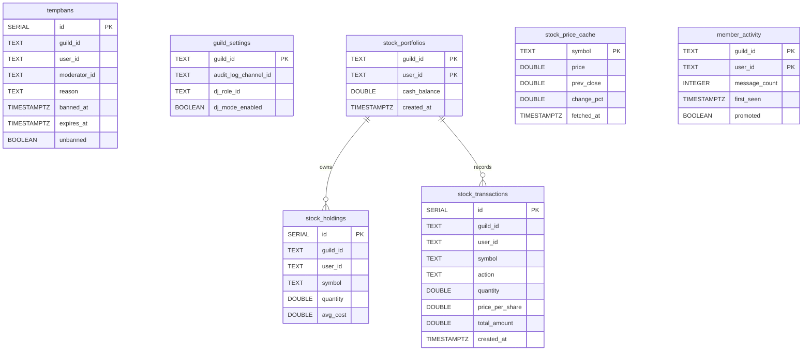

# Database Schema

The bot's persistent state is small and simple. Every table is created
at startup by
[`src/db/mod.rs`](https://github.com/MrMcEpic/discord-bot-rs/blob/master/src/db/mod.rs),
lives inside one Postgres schema picked by the `DB_SCHEMA` environment
variable, and is read or written through helper functions in
[`src/db/queries.rs`](https://github.com/MrMcEpic/discord-bot-rs/blob/master/src/db/queries.rs).
This page enumerates every table, its columns, who writes to it, and
how the schema is bootstrapped.

## Schema isolation recap

As described in [Multi-Instance Model](multi-instance-model.md), the
bot operates inside a Postgres schema whose name comes from `DB_SCHEMA`.
At startup, `init_pool` creates that schema if it doesn't exist, then
configures the pool to run `SET search_path TO "<schema>"` on every new
connection. From that point on, every unqualified table reference in
the query layer resolves inside the instance's own schema. One Postgres
server can host as many instances as you like without any table
collisions or per-query filtering.

## ER diagram



Relationships shown in the diagram are conceptual: there are no actual
foreign keys in the schema. Every stock table carries `(guild_id, user_id)`
as a denormalised composite, and the bot enforces consistency at the
query layer (inside sqlx transactions for multi-table writes). This
decision keeps migrations simple and makes per-guild data easy to
delete in bulk.

## Tables

### `tempbans`

Tracks temporary bans so the unban worker can restore users when their
ban expires. Feature: moderation (`!m ban`, `!m unban`, `!m banlist`).

| Column | Type | Notes |
|---|---|---|
| `id` | `SERIAL PRIMARY KEY` | Auto-incrementing row ID |
| `guild_id` | `TEXT NOT NULL` | Discord guild ID as a string |
| `user_id` | `TEXT NOT NULL` | Banned user's Discord ID |
| `moderator_id` | `TEXT NOT NULL` | Who issued the ban |
| `reason` | `TEXT` | Optional, free-form |
| `banned_at` | `TIMESTAMPTZ NOT NULL DEFAULT NOW()` | When the ban was issued |
| `expires_at` | `TIMESTAMPTZ NOT NULL` | When the ban should be lifted |
| `unbanned` | `BOOLEAN NOT NULL DEFAULT FALSE` | Set TRUE when the user has been unbanned (either by worker or manual) |

**Index:** `idx_tempbans_active` on `(guild_id, expires_at) WHERE unbanned = FALSE`.
This is a partial index — it only covers active bans — so the unban
worker's `WHERE unbanned = FALSE AND expires_at <= NOW()` sweep reads
a small working set even in guilds with a long ban history.

**Writers:**
[`create_tempban`](https://github.com/MrMcEpic/discord-bot-rs/blob/master/src/db/queries.rs)
(from `!m ban` or the `tempban` AI tool),
[`mark_unbanned`](https://github.com/MrMcEpic/discord-bot-rs/blob/master/src/db/queries.rs)
(from `!m unban`),
[`mark_unbanned_by_id`](https://github.com/MrMcEpic/discord-bot-rs/blob/master/src/db/queries.rs)
(from the background unban worker in `main.rs`).

### `guild_settings`

Per-guild configuration that's mutable at runtime: audit log channel,
DJ role, DJ mode toggle. Feature: admin (`!m setlog`, `!m djrole`,
`!m djmode`) and moderation (uses the audit log channel).

| Column | Type | Notes |
|---|---|---|
| `guild_id` | `TEXT PRIMARY KEY` | Discord guild ID |
| `audit_log_channel_id` | `TEXT` | Where moderation actions get logged |
| `dj_role_id` | `TEXT` | Role required when DJ mode is on |
| `dj_mode_enabled` | `BOOLEAN NOT NULL DEFAULT FALSE` | Restrict music commands to the DJ role |

**Writers:** the admin commands write via
`upsert_guild_setting` (string values) and `upsert_guild_setting_bool`
(boolean values). Both functions whitelist their column name against
an `ALLOWED_COLUMNS` list in Rust before constructing the SQL, which
is how the bot safely takes the column name as a parameter.

### `stock_portfolios`

Virtual cash balance for the stock-trading game. One row per
`(guild, user)` pair. Feature: stocks.

| Column | Type | Notes |
|---|---|---|
| `guild_id` | `TEXT NOT NULL` | Part of composite PK |
| `user_id` | `TEXT NOT NULL` | Part of composite PK |
| `cash_balance` | `DOUBLE PRECISION NOT NULL DEFAULT 1000.0` | Everyone starts with $1000 virtual |
| `created_at` | `TIMESTAMPTZ NOT NULL DEFAULT NOW()` | When the portfolio was created |

Primary key is `(guild_id, user_id)`. The portfolio row is created on
demand by `get_or_create_portfolio` using `INSERT ... ON CONFLICT DO
NOTHING` followed by a `SELECT`.

### `stock_holdings`

Share ownership: which symbols a user holds, how many, at what average
cost. Feature: stocks.

| Column | Type | Notes |
|---|---|---|
| `id` | `SERIAL PRIMARY KEY` | Auto-incrementing row ID |
| `guild_id` | `TEXT NOT NULL` | |
| `user_id` | `TEXT NOT NULL` | |
| `symbol` | `TEXT NOT NULL` | Ticker symbol, e.g. `AAPL` |
| `quantity` | `DOUBLE PRECISION NOT NULL DEFAULT 0.0` | Shares held (fractional allowed) |
| `avg_cost` | `DOUBLE PRECISION NOT NULL DEFAULT 0.0` | Weighted average price paid |

**Unique constraint:** `UNIQUE (guild_id, user_id, symbol)` — one row
per symbol per user per guild.

**Index:** `idx_stock_holdings_user` on `(guild_id, user_id)` for
portfolio lookups.

**Writers:** `buy_stock` uses an upsert that recalculates
`avg_cost` as a weighted average:

```
avg_cost = (old_avg * old_qty + new_price * new_qty) / (old_qty + new_qty)
```

`sell_stock` either reduces the quantity or deletes the row if the
remaining amount is less than `0.0001` shares. Both run inside a sqlx
transaction so the cash update, holdings update, and transaction-log
insert commit atomically.

### `stock_transactions`

Immutable audit log of every buy/sell. Feature: stocks.

| Column | Type | Notes |
|---|---|---|
| `id` | `SERIAL PRIMARY KEY` | Row ID |
| `guild_id` | `TEXT NOT NULL` | |
| `user_id` | `TEXT NOT NULL` | |
| `symbol` | `TEXT NOT NULL` | |
| `action` | `TEXT NOT NULL` | `'BUY'` or `'SELL'` |
| `quantity` | `DOUBLE PRECISION NOT NULL` | |
| `price_per_share` | `DOUBLE PRECISION NOT NULL` | |
| `total_amount` | `DOUBLE PRECISION NOT NULL` | `quantity * price_per_share` |
| `created_at` | `TIMESTAMPTZ NOT NULL DEFAULT NOW()` | |

**Index:** `idx_stock_transactions_user` on
`(guild_id, user_id, created_at DESC)` so `!m stock history` can
fetch the most recent N trades without scanning.

### `stock_price_cache`

Short-lived price cache to avoid hammering the Finnhub API. Feature:
stocks.

| Column | Type | Notes |
|---|---|---|
| `symbol` | `TEXT PRIMARY KEY` | |
| `price` | `DOUBLE PRECISION NOT NULL` | Last known price |
| `prev_close` | `DOUBLE PRECISION NOT NULL` | Previous day's close |
| `change_pct` | `DOUBLE PRECISION NOT NULL` | Day-over-day change percentage |
| `fetched_at` | `TIMESTAMPTZ NOT NULL DEFAULT NOW()` | Cache insertion time |

**TTL is enforced at query time:** `get_cached_price` uses
`WHERE fetched_at > NOW() - INTERVAL '60 seconds'`, so anything older
than 60 seconds is ignored and a fresh quote is fetched from the
upstream API. There's no separate eviction job.

### `member_activity`

Tracks messages sent per user per guild, for the auto-role promotion
feature. Feature: auto-role.

| Column | Type | Notes |
|---|---|---|
| `guild_id` | `TEXT NOT NULL` | Part of composite PK |
| `user_id` | `TEXT NOT NULL` | Part of composite PK |
| `message_count` | `INTEGER NOT NULL DEFAULT 0` | Running total of messages sent |
| `first_seen` | `TIMESTAMPTZ NOT NULL DEFAULT NOW()` | When this user first sent a message we counted |
| `promoted` | `BOOLEAN NOT NULL DEFAULT FALSE` | Has the auto-role worker already promoted them |

Primary key is `(guild_id, user_id)`. `increment_message_count` uses
`INSERT ... ON CONFLICT ... DO UPDATE ... RETURNING *` so the caller
gets the latest counts in one round trip, which is what the message
handler uses to decide whether to queue a promotion attempt. See
[Auto-Role](../features/auto-role.md) for the thresholds.

## What's not stored

A lot of state the bot manages lives entirely in memory and never
touches the database. Music queues, active Wordle and Connections
games, rate-limit counters, idle timers, and tempban cache are all
DashMap-based state on `Data`. Restarting the bot loses all of them,
and that's intentional — persisting a music queue across restarts
would create more problems than it solves (stale URLs, replayed
commands, surprise audio when the bot rejoins). Games are re-started
by users on demand; rate limits reset cleanly; idle timers are
disposable.

The things in the database are the things that *must* survive a
restart: tempbans (so the worker can still unban someone),
portfolios and trades (real virtual money), auto-role counters (so
promotions happen at the right time), and DJ-mode settings (so
operators don't have to reconfigure after every deploy).

## Migrations

There is no external migration tool today. The
[`migrate`](https://github.com/MrMcEpic/discord-bot-rs/blob/master/src/db/mod.rs)
function in `src/db/mod.rs` runs a flat list of
`CREATE TABLE IF NOT EXISTS` and `CREATE INDEX IF NOT EXISTS`
statements against the current pool. It's idempotent, runs on every
startup, and is sufficient for bootstrapping a fresh schema or
verifying that an existing one has every expected table.

What it doesn't handle is schema evolution: renaming a column, adding a
`NOT NULL` default, dropping a table. Those operations today require
a manual `psql` session, then updating the bootstrap SQL so new
instances come up with the new shape. Switching to `sqlx::migrate!` or
a standalone tool like `sqlx-cli` is tracked as future work.

## Connection pool

The pool is a `sqlx::PgPool` built once in `main.rs` and handed to
`Data::db`. Every feature module holds an `&PgPool` (or clones the pool
— cloning is cheap because it's just an `Arc` bump) and uses sqlx's
async query methods directly. There's no repository layer, no DAO, no
ORM — queries are SQL strings in `src/db/queries.rs` with typed
parameter binding and `FromRow` deserialisation.

Most queries use `query_as::<_, Model>` for typed reads and `query`
for writes. The compile-time-checked macros (`query!`, `query_as!`)
aren't used here because they'd require `sqlx-cli` to generate
`sqlx-data.json` against a live database as part of the build, and
the project prefers a simpler Docker build.

## Backups

Backup strategy is owned by the Postgres container, not the bot. See
[PostgreSQL Setup](../deployment/postgres-setup.md) for the
recommended approach. Because every instance's data lives in one
schema, `pg_dump --schema=<schema>` gives you a clean per-instance
backup, and dropping or restoring one schema leaves the others
untouched.

## Cross-links

- [Multi-Instance Model](multi-instance-model.md) — why the schema
  boundary is the multi-tenancy line.
- [PostgreSQL Setup](../deployment/postgres-setup.md) — deployment,
  tuning, backup.
- [Data Flow](data-flow.md) — how commands reach the pool from event
  handlers.
