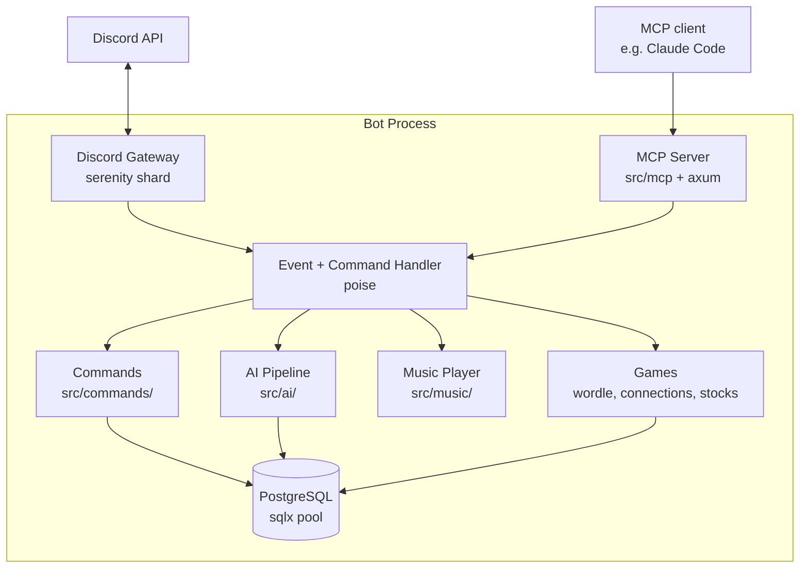

# Architecture Overview

discord-bot-rs is built from small, well-isolated modules communicating
through a central shared [`Data`](https://github.com/MrMcEpic/discord-bot-rs/blob/master/src/main.rs)
struct and a handful of Discord event handlers. The process is a single
Tokio runtime that hosts a Discord client, a Postgres connection pool, and
an embedded MCP server, plus whichever feature modules you've turned on in
`config.toml`. Everything else — music players, game state, rate limiters,
the AI pipeline — hangs off `Data` and is accessed async-safely through
per-guild or per-channel maps. This page sketches the high-level shape;
the rest of the architecture section drills into each piece.

## Components

One Tokio process hosts a serenity shard (the WebSocket to Discord's
gateway), a poise dispatcher wrapped around it, and an axum-based MCP
server bound on a local port. Gateway events flow into the event handler,
which either fires a command (via poise) or routes the event directly to a
feature module — the AI pipeline for `@mention`s and replies, the music
player for voice state updates, the games module for interaction buttons.
Every module talks to the Postgres pool through `sqlx`. The MCP server is
a separate ingress point: it exposes tools like `list_guilds` and
`send_message` to outside clients, and its handlers reach into the same
shared state the event handler uses.

## The `Data` struct

Poise gives every handler a typed reference to a user-defined state
struct. In this project that struct is
[`Data`](https://github.com/MrMcEpic/discord-bot-rs/blob/master/src/main.rs),
defined at the top of `src/main.rs`. It holds:

- **`db: sqlx::PgPool`** — the shared Postgres connection pool.
- **`http_client: reqwest::Client`** — a preconfigured HTTP client for yt-dlp,
  DeepSeek, Gemini, Finnhub, DuckDuckGo scraping, and any other outbound
  HTTP work a feature needs.
- **`config: Config`** — loaded from environment variables at startup.
- **`personality: String`** and **`bot_name: String`** — per-instance identity.
- **Optional feature configs** — `auto_role_config`, `minecraft_config`,
  `join_role_config`, `welcome_config`, etc. Each is `Option<T>` so that
  disabled features simply hold `None`.
- **Per-guild state maps**: `guild_players`, `track_handles`,
  `now_playing_msgs`, `idle_timers`, `connections_games`, `wordle_games`.
  All are `Arc<DashMap<..., Arc<Mutex<T>>>>`, giving lock-free guild lookup
  with serialised access inside one guild.
- **`rate_limiters: RateLimiters`** — sliding-window limiters for AI, music,
  moderation, and stock tools, keyed by user ID.
- **`mcp_started: AtomicBool`** and **`started_at: DateTime<Utc>`** — one-shot
  flags used to guard the MCP server against gateway reconnects and to
  let the AI history builder ignore messages from previous bot
  lifetimes.

A single `Arc<Data>` is cloned into every command context, event handler
future, and background task. Cheap to clone, shared everywhere, no global
state — see [Concurrency Model](concurrency-model.md) for why this shape
works without contention.

## Per-instance model

Each running bot is a separate Linux process with its own `Data`, its own
Discord token, its own Postgres schema, and its own instance config
directory. "Multi-tenant" here means "run two containers with two
`.env` files," not "one process with guild-scoped data." The
[Multi-Instance Model](multi-instance-model.md) page explains the
boundaries and why the project chose a schema-per-instance approach over
the alternatives.

## How events flow

Discord pushes an event down the gateway. serenity parses it into a
typed variant and hands it to poise's event dispatcher, which either
matches a prefix command (the `!m` family) and runs the command handler,
or calls the plain [`event_handler`](https://github.com/MrMcEpic/discord-bot-rs/blob/master/src/events/mod.rs)
for everything else. The event handler is one big `match` over
`FullEvent` variants — ready, message create, voice state update,
interaction create, member add — and each arm dispatches to the
corresponding feature module. Responses go back to Discord via serenity's
HTTP client. The full lifecycle is in [Data Flow](data-flow.md).

## Major modules

| Module | Responsibility |
|---|---|
| [`src/main.rs`](https://github.com/MrMcEpic/discord-bot-rs/blob/master/src/main.rs) | Entry point, `Data` struct, framework init, background task spawning |
| [`src/config.rs`](https://github.com/MrMcEpic/discord-bot-rs/blob/master/src/config.rs) | Environment variable loading |
| [`src/instance_config.rs`](https://github.com/MrMcEpic/discord-bot-rs/blob/master/src/instance_config.rs) | `config.toml` parsing for per-instance feature flags |
| [`src/error.rs`](https://github.com/MrMcEpic/discord-bot-rs/blob/master/src/error.rs) | `BotError` enum and `From` conversions |
| [`src/commands/`](https://github.com/MrMcEpic/discord-bot-rs/tree/master/src/commands) | Every prefix command, all parented under `!m` |
| [`src/events/`](https://github.com/MrMcEpic/discord-bot-rs/tree/master/src/events) | Gateway event dispatcher, message handler, voice-state handler |
| [`src/ai/`](https://github.com/MrMcEpic/discord-bot-rs/tree/master/src/ai) | DeepSeek/Gemini pipeline, tool execution, response sanitising |
| [`src/music/`](https://github.com/MrMcEpic/discord-bot-rs/tree/master/src/music) | Per-guild player, yt-dlp + songbird pipeline, voice handling |
| [`src/wordle/`](https://github.com/MrMcEpic/discord-bot-rs/tree/master/src/wordle) | Wordle game state and puzzle fetching |
| [`src/connections/`](https://github.com/MrMcEpic/discord-bot-rs/tree/master/src/connections) | NYT Connections game state and puzzle fetching |
| [`src/stocks/`](https://github.com/MrMcEpic/discord-bot-rs/tree/master/src/stocks) | Virtual stock trading, Finnhub integration |
| [`src/minecraft/`](https://github.com/MrMcEpic/discord-bot-rs/tree/master/src/minecraft) | Minecraft link verification, donator sync, chargeback webhooks |
| [`src/autorole.rs`](https://github.com/MrMcEpic/discord-bot-rs/blob/master/src/autorole.rs) | Time/message-based role promotion |
| [`src/mcp/`](https://github.com/MrMcEpic/discord-bot-rs/tree/master/src/mcp) | Embedded MCP server and tool definitions |
| [`src/db/`](https://github.com/MrMcEpic/discord-bot-rs/tree/master/src/db) | Connection pool, models, query helpers |
| [`src/util/`](https://github.com/MrMcEpic/discord-bot-rs/tree/master/src/util) | Rate limiters, duration parsing |

## Tech choices

- **[serenity](https://github.com/serenity-rs/serenity)** — Rust's mature
  Discord library, the foundation for everything else. Chosen for its
  stable gateway handling and typed model objects.
- **[poise](https://github.com/serenity-rs/poise)** — a command framework
  built on serenity. Used for its prefix-command parsing, subcommand
  tree, and typed `Context<'_, Data, BotError>`. Saves hundreds of lines
  of boilerplate compared to raw serenity.
- **[songbird](https://github.com/serenity-rs/songbird)** — the voice
  driver. Handles voice gateway, UDP, and Opus packet assembly so this
  project only has to feed it audio bytes.
- **[sqlx](https://github.com/launchbadge/sqlx)** — async Postgres client
  with compile-time-checked queries. Chosen over an ORM for explicitness
  and because the schema is small enough not to need one.
- **[dotenvy](https://github.com/allan2/dotenvy)** — reads `.env` at
  startup. Modern maintained fork of the classic `dotenv` crate.
- **[rmcp](https://github.com/modelcontextprotocol/rust-sdk)** — the
  official Rust SDK for the Model Context Protocol; used for the
  embedded MCP server.
- **[axum](https://github.com/tokio-rs/axum)** — HTTP server. The MCP
  server and (optionally) chargeback webhook router run on axum inside
  the same Tokio runtime as the Discord client.
- **[dashmap](https://github.com/xacrimon/dashmap)** — a lock-free
  concurrent hash map. Used for every per-guild and per-channel state
  map so that work in one guild never blocks work in another.

## Where to go next

- [Multi-Instance Model](multi-instance-model.md) for the process and
  schema layout when you run more than one bot against one Postgres.
- [Data Flow](data-flow.md) for the step-by-step lifecycle of a single
  Discord event.
- [AI Pipeline](ai-pipeline.md) for how `@mention` → response actually
  works, including tool-use loops.
- [Music Pipeline](music-pipeline.md) for the yt-dlp + songbird path.
- [Concurrency Model](concurrency-model.md) for `DashMap` + `tokio::Mutex`
  patterns and why locks are the last tool, not the first.
- [Error Handling](error-handling.md) for how `BotError` reaches users.
- [Database Schema](database-schema.md) for every table and what owns it.
