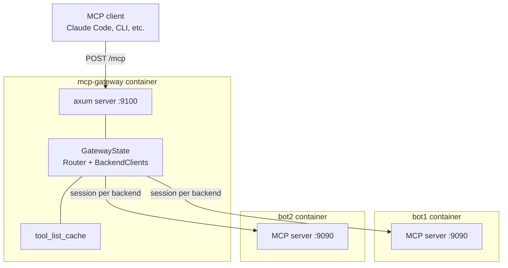

# MCP Gateway Routing

Each bot instance runs its own MCP server on port 9090. A small companion
crate, `mcp-gateway`, sits in front of those servers and routes incoming
MCP requests to the right backend. This page explains why the gateway
exists, how it picks a target, and how it stays synchronised with the
backends over time.

For the user-facing side of MCP — how to connect a client, how to call
tools — see [MCP Server](../features/mcp-server.md) and
[MCP Tool Catalog](../reference/mcp-tool-catalog.md). For deploying it
safely to a public host, see [MCP Exposure](../deployment/mcp-exposure.md).

## Why the gateway exists

The Model Context Protocol is session-oriented and connection-oriented.
A client (for example Claude Code) opens one session against one MCP
endpoint and issues tool calls over that session. If you're running two
bot instances and want to send tool calls to both, the obvious approach
— configure the client with two endpoints — has two problems:

1. **Every new instance breaks your client config.** Adding a third bot
   means editing the client's `mcp.json`, reloading the client, and
   hoping you didn't typo the URL.
2. **Every tool call has to pick an instance out of band.** Your prompt
   has to say "on bot1, list the guilds"; there's no way to say "list
   the guilds on the bot serving guild 1234" and let the system figure
   out which bot that is.

The gateway solves both. Clients point at one URL (the gateway). They
see a single tool catalog. Each tool acquires an optional `instance`
parameter, injected by the gateway, and they can also pass `guild_id`
and have the gateway figure out which instance serves that guild.
Adding a new bot is a docker-compose line plus a gateway restart —
clients don't change anything.

## Topology



The gateway is a standalone axum app on port 9100. It keeps one open
MCP session to each backend and multiplexes requests from clients onto
those persistent sessions. Clients do not know backends exist; backends
do not know other backends exist.

## Routing model

The gateway configuration is a single environment variable, `INSTANCES`,
formatted as comma-separated `name=url` pairs:

```
INSTANCES="bot1=http://bot1:9090,bot2=http://bot2:9090"
```

[`GatewayConfig::from_env`](https://github.com/MrMcEpic/discord-bot-rs/blob/master/mcp-gateway/src/config.rs)
parses this into a `Vec<Instance>` at startup. Each name becomes a
routing key and each URL becomes a backend target. The gateway panics
if `INSTANCES` is missing — a misconfigured gateway is a hard failure.

Routing itself is a two-step decision in
[`mcp-gateway/src/routing.rs`](https://github.com/MrMcEpic/discord-bot-rs/blob/master/mcp-gateway/src/routing.rs):

1. **Explicit instance wins.** If the tool call's arguments contain an
   `instance` field (injected by the gateway into every tool's schema),
   the router looks up that name in `instances: HashMap<String, String>`
   and routes there. Unknown instance names return
   `RouteError::InstanceNotFound`.
2. **Otherwise, match by `guild_id`.** If the arguments contain a
   `guild_id`, the router consults its `guild_map: Arc<RwLock<HashMap<String, String>>>`,
   where the keys are guild IDs and the values are instance names. If
   the map has the ID, it routes to that instance. If it doesn't,
   returns `RouteError::GuildNotFound`.
3. **Neither present** returns `RouteError::NoTarget`, which the
   server layer turns into a helpful "available instances: ..." error.

The guild map is populated by calling each backend's `list_guilds` tool
at startup and every 5 minutes thereafter (see "Lifecycle" below).

## Session management

MCP's Streamable HTTP transport uses Server-Sent Events (SSE) with a
session ID header (`Mcp-Session-Id`). The backend opens the SSE stream
on the initial POST, keeps it open, and sends JSON-RPC responses down
it indexed by request ID. Each subsequent POST carries the session
header so the backend knows which session the request belongs to.

The gateway maintains one `BackendClient` per configured instance, each
with its own persistent session. On startup, `initialize_backends`
calls `initialize` on every client — which does the MCP handshake
(`initialize` request, read response, send `notifications/initialized`,
start a background task that keeps the SSE stream open for future
responses). Once initialised, subsequent tool calls reuse that session.

When a client sends a request to the gateway, the flow is:

1. Client → Gateway: single JSON-RPC POST to `/mcp`.
2. Gateway inspects `method`. For `tools/list`, the cached tool list
   is returned immediately. For `tools/call`, the gateway extracts
   `instance`, `guild_id`, and the tool arguments from `params`, picks a
   target via the router, and forwards the call to the chosen backend's
   `BackendClient::call_tool`.
3. `BackendClient::call_tool` posts to `<backend>/mcp`, reads the
   response from the POST's own SSE stream, and returns the result.
4. Gateway wraps the result in an `event: message\ndata: {...}\n\n` SSE
   frame and sends it back to the client with `Mcp-Session-Id: gateway-session`.

The gateway uses a single synthetic session ID (`gateway-session`) for
all client connections, because it doesn't actually track per-client
state — every gateway request is a stateless proxy onto the backend's
real session. This is simpler than forwarding real session IDs and
avoids the problem of tying a gateway restart to session IDs clients
still expect to see.

## Session recovery

MCP sessions can expire. When the backend returns a `404 Not Found` or
an error mentioning "Session not found", `handle_tool_call` in
[`mcp-gateway/src/server.rs`](https://github.com/MrMcEpic/discord-bot-rs/blob/master/mcp-gateway/src/server.rs)
re-initialises the dead backend client in place and retries the tool
call once. This is transparent to the client: a successful retry looks
exactly like a first-try success.

On top of the on-demand recovery, a background task spawned in
[`mcp-gateway/src/main.rs`](https://github.com/MrMcEpic/discord-bot-rs/blob/master/mcp-gateway/src/main.rs)
calls `refresh_guild_map` every 5 minutes. That method health-checks
every backend, re-initialises any unhealthy ones, and re-fetches each
backend's guild list to update the router's guild map. Guild
memberships can change — a bot joins a new server, leaves an old one —
and the 5-minute refresh keeps the map current without client action.

## Tool catalog

The gateway doesn't define its own tools. On startup (and after
re-init), it picks one arbitrary backend, calls `tools/list` on it,
and caches the result. Every tool schema is mutated in flight to add
an `instance` property:

```json
"instance": {
    "type": "string",
    "description": "Bot instance name to route to (e.g., 'bot1', 'bot2'). If omitted, routes by guild_id."
}
```

The gateway also appends its own synthetic tool:

- **`list_instances`** — returns a text blob listing every registered
  backend, its online/offline status, and the guilds it's currently
  known to serve. Clients call this to discover the topology.

Because all instances run the same binary, their tool catalogs are
identical, so asking one backend for tools is sufficient. If you ever
run backends with mismatched tool sets, you'd need to change the
catalog-building logic to union them.

## Authentication

The gateway supports a single bearer token via the `MCP_AUTH_TOKEN`
environment variable, enforced by an axum `auth_middleware` in
`server.rs`. If the variable is set, every request must carry
`Authorization: Bearer <token>` or it's rejected with 401. If the
variable is unset or empty, the middleware passes everything through —
useful for local development, not safe to run on a public port.

The gateway talks to each backend over plain HTTP on the internal
Docker network with no auth, because the backends bind to `127.0.0.1`
and aren't reachable from outside the compose network. The bot's own
`MCP_AUTH_TOKEN` is still useful when the backend is bound to a host
port; see [MCP Exposure](../deployment/mcp-exposure.md) for the
trade-offs.

Claude Code's current MCP client prefers OAuth 2.1 over bearer tokens
for remote servers, so running the gateway as a Claude Code
remote-server target is more work than bearer auth suggests. Support
for OAuth 2.1 in the gateway is tracked as future work.

## Deployment topology

The gateway runs in its own Docker container from `mcp-gateway/Dockerfile`,
alongside the bot containers. Its compose service (in the project's
top-level `docker-compose.yml`) declares `depends_on: bot` with
`condition: service_healthy`, so the gateway doesn't start until at least
one backend is reachable. It binds its port to `127.0.0.1:9100` by
default, keeping it local; operators who want remote MCP access
typically front it with a reverse proxy that terminates TLS and adds
whatever authentication their environment needs.

The health-check side uses the backend's `curl` on
`http://localhost:9090/mcp` to decide when the bot is ready to proxy
requests to — a simple 2xx check on the HTTP endpoint.

## Future work

- **OAuth 2.1 support.** Bearer tokens are fine for scripts, but
  Claude Code's remote-server transport really wants OAuth. Adding an
  OAuth 2.1 code-flow endpoint to the gateway is the main gap before
  it's ready for general consumer use.
- **Dynamic instance registration.** Today `INSTANCES` is read once at
  startup. An admin API to add/remove backends at runtime would avoid
  the restart cycle.
- **Per-client sessions.** The gateway collapses every client onto one
  synthetic session. Real per-client sessions would allow tool-call
  cancellation and progress streaming.
- **Streaming tool responses.** The current proxy waits for the full
  result from the backend and then sends one SSE frame back. Real
  streaming would let backends emit progress events for long-running
  tools.

## Cross-links

- [MCP Server](../features/mcp-server.md) — the user-facing description
  of what MCP does in this project.
- [MCP Tool Catalog](../reference/mcp-tool-catalog.md) — the full list
  of tools the gateway exposes.
- [MCP Exposure](../deployment/mcp-exposure.md) — deployment patterns
  for running the gateway on a public host.
- [Multi-Instance Model](multi-instance-model.md) — the deployment
  model the gateway was built for.
