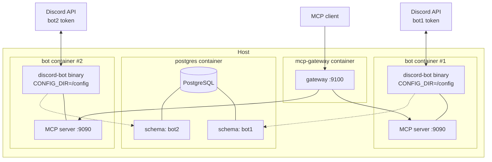

# Multi-Instance Model

discord-bot-rs is designed to run more than one bot at a time on the same
host — different Discord identities, different personalities, different
feature sets, sharing one Postgres server and one MCP gateway. This page
explains what an "instance" actually is, where the isolation boundaries
sit, and why the project chose a schema-per-instance approach over the
alternatives you'd usually reach for.

If you just want to deploy two bots, see
[Multi-Instance Deployment](../deployment/multi-instance-deployment.md).
This page is the architectural rationale behind that recipe.

## What an instance is

An **instance** is a tuple of four things:

1. **One Discord bot identity** — its own `DISCORD_TOKEN`, `CLIENT_ID`,
   and `GUILD_ID`.
2. **One config directory** — a path on disk containing `config.toml`,
   `personality.txt`, an `.env` file, and whatever optional feature files
   (welcome prompt, cookies, etc.) that instance uses.
3. **One Postgres schema** — selected by the `DB_SCHEMA` environment
   variable. All of the instance's persistent state lives inside it.
4. **One Linux process** — in practice, one container running the
   `discord-bot-rs` binary. Each process has its own Tokio runtime, its
   own `Data` struct, its own memory state, its own MCP server on its own
   port.

Nothing in the bot code is aware of other instances. The binary reads a
single `.env`, mounts a single `CONFIG_DIR`, talks to a single schema, and
serves a single Discord token. You get multi-tenancy by running the
binary twice with two configurations, not by having one process juggle
multiple identities.

## Topology

Each bot container has its own `/config` volume mount and its own `.env`,
so they see completely different `DISCORD_TOKEN`, `CONFIG_DIR`, and
`DB_SCHEMA` values. Both bots connect to the same Postgres server but
operate on different schemas, so their tables never collide. The gateway
container sits in front of both MCP servers on an internal Docker network
and presents a single endpoint to outside tools.

## Isolation boundaries

The same instance can be cloned, renamed, or retired without touching the
others. Here's what's isolated and where each boundary is enforced.

1. **Process.** Each instance is a separate Docker service (or plain
   process) with its own Tokio runtime, memory, and lifetime. Crashing
   one takes the others with it only if they share a container, which
   [Docker Compose setups](../deployment/docker-compose.md) avoid by
   default.
2. **Config.** `CONFIG_DIR` points at a per-instance directory. The bot
   reads `config.toml`, `personality.txt`, the optional welcome prompt,
   and (for music) `cookies.txt` from that path. Two instances can ship
   completely different `config.toml` feature flags and the code will
   ignore them independently.
3. **Database.** `DB_SCHEMA` selects a Postgres schema. See below for how
   `sqlx` threads this through the pool. Bot A can migrate its schema
   without affecting Bot B, and you can drop one schema without
   touching the other.
4. **Personality.** Each instance has its own `personality.txt` loaded
   into `Data::personality` at startup. The AI system prompt interpolates
   this string, so the two bots have different voices even if they share
   every other config value.
5. **Discord identity.** Token, client ID, and guild are environment
   variables, so they live in each instance's `.env`. The Discord gateway
   has no concept of "the same binary running twice" — each token opens
   its own shard connection.

## Schema-per-instance: how it works

The database setup lives in
[`src/db/mod.rs`](https://github.com/MrMcEpic/discord-bot-rs/blob/master/src/db/mod.rs).
At startup, `init_pool` takes the `DATABASE_URL` and the `DB_SCHEMA` name
and does three things:

1. Opens a one-off connection and runs `CREATE SCHEMA IF NOT EXISTS "<schema>"`.
2. Builds a `PgPoolOptions` with an `after_connect` hook that runs
   `SET search_path TO "<schema>"` on every new connection the pool hands
   out.
3. Runs the migration SQL (currently a set of `CREATE TABLE IF NOT EXISTS`
   statements) against the freshly configured pool, so the tables land in
   the right schema.

The key move is the `search_path` hook. Postgres resolves unqualified
table names by walking `search_path` in order, so as long as every
connection has `search_path = <schema>`, every `SELECT * FROM tempbans`
in the codebase silently becomes `SELECT * FROM "<schema>".tempbans`. No
feature module has to know the schema name, no query has to be
parameterised. The abstraction is completely transparent to the rest of
the code.

Migrations are a tradeoff of their own. Today, `migrate` runs a flat list
of `CREATE TABLE IF NOT EXISTS` statements. That's enough to bootstrap a
new schema but doesn't handle schema evolution gracefully. A proper
migration tool is future work; the current setup is "good enough until we
need to rename a column."

## What's shared

A few things cross instance boundaries on purpose, because isolating them
would cost more than it's worth:

- **The Postgres server.** One Postgres process, one connection
  listener, one set of backups. Each instance gets its own schema inside
  that server. Running two Postgres containers just to keep bots apart
  would waste RAM and double the ops surface.
- **The Docker network.** All bot containers, the Postgres container, and
  the MCP gateway share an internal bridge network. That's how
  `mcp-gateway` reaches `http://bot1:9090` by name.
- **The host.** CPU, disk, memory, the kernel — everything underneath
  Docker is shared. If you need stronger isolation than "same Linux host"
  you're looking at a different architecture.
- **The mcp-gateway container.** One gateway fronts all instances. See
  [MCP Gateway Routing](mcp-gateway-routing.md) for how it picks which
  bot to forward a tool call to.

## Why not the alternatives

Three approaches were considered before landing on schema-per-instance.

**Separate Postgres databases.** Instead of one server with many schemas,
you could spin up one Postgres database per bot. This gives stronger
isolation — separate `pg_stat`, separate WAL, separate roles — at the
cost of doubling your connection count and making backups harder. For a
bot whose per-instance data is measured in kilobytes, the cost isn't
justified. Schemas inside one database give you every isolation
property that actually matters (no accidental cross-instance queries,
independent migrations, drop-and-recreate safety) without the overhead.

**Single schema, `guild_id` column.** The other extreme: one schema,
every table has a `guild_id` column, every query adds
`WHERE guild_id = $1`. This is how Discord bots usually handle
multi-tenancy. It works for a shared public bot, but it makes "run a
second bot with a different personality against the same server" a lot
harder. Every test fixture, every migration, every ad-hoc SQL query now
has to carry the guild ID as ceremony, and there's no isolation if buggy
code accidentally forgets the filter. For the use case this project
targets — self-hosters running a handful of dedicated bots — the schema
boundary is a much safer default.

**Separate Postgres containers.** The nuclear option: one entire
Postgres per bot. Each container is a full Postgres, so you pay its full
RAM footprint, its full startup time, and its full ops burden. For two
bots on a small VPS, this is 200–400 MB of overhead to solve a problem
that schemas already solve for free.

## Concurrency across instances

Because instances are separate processes with their own `Data`, there is
zero shared in-memory state. One bot can be cranking through a music
queue and another can be handling a moderation action at the same time
without any lock contention whatsoever — the two runtimes don't even see
each other. Scaling is linear until Postgres becomes the bottleneck,
which for this workload is "many hundreds of active bots on one box."

The flip side is that there's also no cross-instance coordination. Bot A
cannot send a message to a channel that only Bot B has permission to
post in. Bot A cannot read Bot B's music queue. If you need that, you
need to build it through the MCP gateway or an external message bus —
the bot framework itself doesn't model it.

## Adding an instance

Operationally, adding a new instance is copy-paste plus a restart. Make a
new directory under `instances/`, fill in `config.toml`, `.env`, and
`personality.txt`, copy the `bot` service in `docker-compose.yml`, rename
it, point its volume at the new directory, run `docker compose up -d`.
The [Multiple Instances](../configuration/multiple-instances.md)
configuration page walks through the `.env` and `config.toml` side. The
[Multi-Instance Deployment](../deployment/multi-instance-deployment.md)
deployment page walks through the compose file and the gateway
registration.

## Known limits

- **No cross-instance messaging.** Each process is an island. There's no
  built-in way for one bot to trigger an action in another one.
- **No shared in-memory state.** Rate limiters, music queues, game state
  — none of it crosses processes. If you need shared state, you'd put it
  in Postgres.
- **No dynamic instance add/remove.** Adding a new instance means
  editing `docker-compose.yml` and restarting `docker compose`. There's
  no admin API to register a new bot at runtime.
- **MCP gateway routing is static.** The gateway reads `INSTANCES` from
  its environment once at startup and refreshes the guild map every five
  minutes. It doesn't discover new backends on the fly.

See [MCP Gateway Routing](mcp-gateway-routing.md) for how a single MCP
client talks to all these instances through one URL, and
[Configuration Overview](../configuration/index.md) for how to split
config between environment and `config.toml`.
