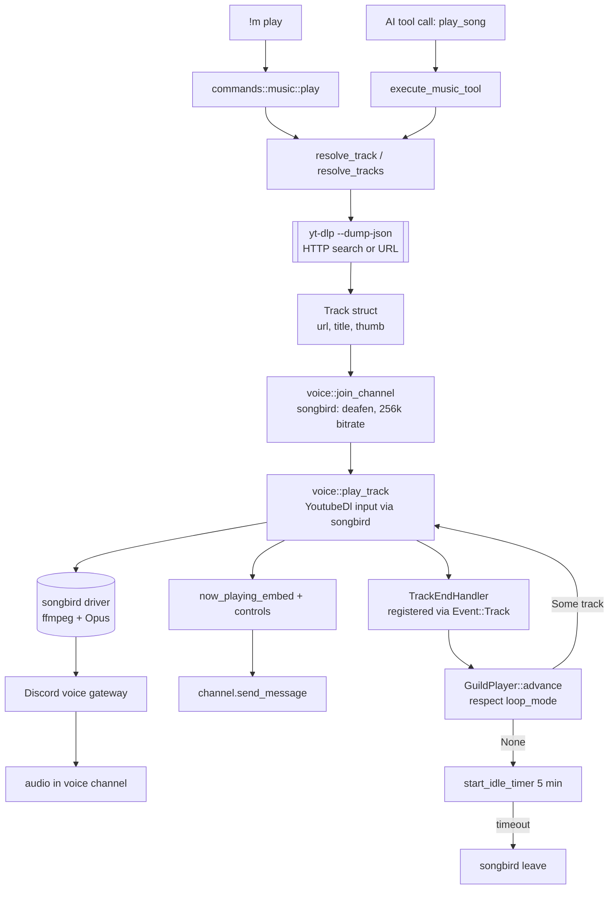

# Music Pipeline

From a `!m play <query>` command or an AI tool call to audio playing in
a voice channel. This page follows every step of the path so you can
add features, debug playback issues, or reason about what happens when
yt-dlp fails at 3 a.m.

For how users interact with music features, see
[Music](../features/music.md).

## Sequence



Two entry points, one pipeline. The prefix command path and the AI tool
path both converge on `resolve_track`, then both use `voice::play_track`
to hand the URL to songbird. After that, track advancement is driven by
songbird's `TrackEvent::End` hook, not by polling.

## The `MusicPlayer` struct

Per-guild state lives in
[`GuildPlayer`](https://github.com/MrMcEpic/discord-bot-rs/blob/master/src/music/player.rs):

- `queue: VecDeque<Track>` — upcoming tracks, bounded to 100 entries
  (`MAX_QUEUE_LENGTH`).
- `current: Option<Track>` — what's playing right now, or `None` if the
  player is idle.
- `loop_mode: LoopMode` — `Off`, `Track`, or `Queue`. Cycles through
  those three values when the loop button is pressed.
- `paused: bool` — tracks paused state so the now-playing embed can
  show the right icon.
- `skip_in_progress: Arc<AtomicBool>` — see
  [Skip race](#skip-race-suppressing-the-spurious-trackend) below.

The struct is plain data plus a handful of methods (`enqueue`,
`enqueue_many`, `advance`, `skip_current`, `stop_all`, `remove`,
`shuffle`, `leave_empty`). None of those methods touch the Tokio
runtime, do I/O, or know anything about songbird. That's deliberate:
the player is a pure state machine, and the music pipeline wraps it in
an `Arc<Mutex<GuildPlayer>>` stored in `Data::guild_players`. Every
feature that reads or mutates the player takes the lock, works with
plain Rust data, and releases it. See
[Concurrency Model](concurrency-model.md) for why this separation
matters.

The interesting method is `advance`. It implements loop semantics:

- `LoopMode::Track` returns a clone of the current track (play it
  again).
- `LoopMode::Queue` pushes the current track back onto the queue's
  tail, then pops the front.
- `LoopMode::Off` drops the current track and pops the next one from
  the queue.

If the queue is empty after popping, `advance` returns `None` and the
caller uses that as the signal to leave the voice channel.

## Track resolution

A raw user query — `"sabrina carpenter espresso"`, a YouTube URL, a
playlist URL — becomes a `Track` via
[`src/music/track.rs`](https://github.com/MrMcEpic/discord-bot-rs/blob/master/src/music/track.rs).
The `resolve_track` and `resolve_tracks` helpers shell out to `yt-dlp`
with `--dump-json --no-download` and parse the NDJSON output into one
or more `Track` structs (URL, title, duration, thumbnail, requested-by
display name).

The yt-dlp invocation is a little unusual because YouTube's age and
region gates require a browser session. The bot passes several flags:

- `--cookies <path>` — supplies a `cookies.txt` file exported from a
  logged-in browser. The path is the `cookies.txt` in the current
  working directory if it exists (so per-instance containers can mount
  their own).
- `--js-runtimes node:<path>` — tells yt-dlp to solve JavaScript
  challenges using a specific Node binary. The default `node` path
  isn't always on `PATH` in service environments, so the code probes
  `/home/webapps/.nvm/versions/node/v20.20.1/bin/node` first and falls
  back to `node`.
- `--remote-components ejs:github` — lets yt-dlp pull JS extractor
  patches from its GitHub repo when the built-in ones are out of date.
- `--no-playlist` or `--flat-playlist` depending on whether the caller
  wants one track or the whole URL's contents.

If yt-dlp fails with output that looks like a cookie problem ("page
needs to be reloaded", "sign in to confirm", "this helps protect our
community"), the bot retries without the `--cookies` flag and, on
success, returns `cookies_stale = true` so the caller can warn the user
that cookies need refreshing. Non-cookie failures bubble up as errors.

## Joining and playing

Once there's a `Track`, the pipeline joins the user's voice channel via
[`voice::join_channel`](https://github.com/MrMcEpic/discord-bot-rs/blob/master/src/music/voice.rs).
This calls songbird's `manager.join(guild_id, channel_id)`, self-deafens
the bot (so it doesn't waste bandwidth receiving audio), and sets the
voice bitrate to 256 kbps.

Playback happens through songbird's `YoutubeDl` input source:

```
let source = YoutubeDl::new(http_client, url).user_args(ytdlp_user_args());
handler.play_input(source.into())
```

`ytdlp_user_args()` passes the same cookies/node-runtime/remote-components
flags as above. Songbird runs yt-dlp, reads its stdout, pipes it through
ffmpeg (internally), and feeds the Opus-encoded frames to Discord's
voice UDP.

`play_input` returns a `TrackHandle` which the bot stores in
`Data::track_handles` keyed by guild ID, so pause/resume buttons and AI
tool calls can find the right handle to act on.

## Track-end event and the idle timer

Songbird fires a `TrackEvent::End` when playback finishes. The bot
registers a custom
[`TrackEndHandler`](https://github.com/MrMcEpic/discord-bot-rs/blob/master/src/music/voice.rs)
on every track via `track_handle.add_event(Event::Track(TrackEvent::End), handler)`.
When the event fires, the handler:

1. Looks up the `GuildPlayer` for this guild.
2. Checks the per-guild `skip_in_progress` flag and bails out if set
   (see [Skip race](#skip-race-suppressing-the-spurious-trackend)).
3. Calls `advance()` to figure out what plays next.
4. If there's a next track, starts it with `play_next_from_context`
   and replaces the prior "Now Playing" message via
   `replace_now_playing_message` (delete old + send new under one
   mutex hold).
5. If there isn't, starts the idle timer.

### Skip race: suppressing the spurious TrackEnd

`handler.stop()` causes songbird to fire `TrackEvent::End` for the
track being stopped. The end handler attached to that track would
then see "track ended naturally" and call `advance()` — which on a
`!m skip` would skip *past* the song the caller is about to play,
because the caller has already advanced the queue itself before
calling `play_track`. Songbird 0.6 has no way to detach an event
listener from a `TrackHandle`, so the bot can't simply remove the
handler before the stop.

The fix is a per-guild `skip_in_progress: Arc<AtomicBool>` on
`GuildPlayer`. Right before any code path that calls
`handler.stop()` on an existing track and immediately starts a new
one, the caller sets the flag to `true`. When the stale `TrackEnd`
event arrives, `TrackEndHandler::act` swaps the flag back to `false`
with `swap(false, Ordering::SeqCst)` and, if it was `true`, returns
early without advancing. The next *natural* `TrackEnd` (after the
new track finishes) sees the flag as `false` and proceeds normally.

Because the flag is an `AtomicBool`, no lock is needed, and the
swap-on-read pattern guarantees exactly one of the two events
(skip-induced End vs. natural End) is consumed by the bail-out path.

### NP message lifecycle

Three different code paths can replace the "Now Playing" embed:
the prefix command, the AI tool's "play song" path, and the
`TrackEndHandler` advancing to the next track. Previously each path
sent its new NP message independently and only the track-end handler
remembered to delete the prior one, leaving orphan embeds with stale
buttons whenever a `!m play` or AI tool call replaced an existing
track.

All three paths now go through a single
`replace_now_playing_message` helper in
[`src/music/voice.rs`](https://github.com/MrMcEpic/discord-bot-rs/blob/master/src/music/voice.rs).
The helper takes the per-guild `Arc<Mutex<Option<MessageId>>>` slot,
locks it for the whole sequence, deletes the prior message ID if
one is stored, sends the new embed (with optional component rows),
and stores the new message ID into the slot before releasing the
mutex. Holding the lock across delete-then-send is intentional: it
prevents two concurrent skip operations in the same guild from
racing each other into a partially-deleted, partially-orphaned
state. Failures to delete the prior message (the user could have
deleted it manually) are swallowed at debug level — the new message
still gets sent and recorded.

The idle timer is the mechanism that gets the bot out of the channel
politely when the queue runs dry. `start_idle_timer` spawns a task that
sleeps 5 minutes, then calls `songbird.leave` and cleans up the
per-guild maps. The task's `JoinHandle` is stored in `Data::idle_timers`
so that new tracks (or explicit stops) can cancel it with `.abort()`.

This two-step — store the handle in a per-guild `Arc<Mutex<Option<..>>>`,
cancel it before starting anything new — is why the `idle_timers`
DashMap exists. A new `!m play` call on an idle bot cancels the pending
leave timer before joining, preventing a race where the bot would leave
mid-song.

The voice-state-update handler in
[`src/events/voice_state.rs`](https://github.com/MrMcEpic/discord-bot-rs/blob/master/src/events/voice_state.rs)
is a separate trigger: when the *user* side of the voice channel goes
empty (all humans left), it short-circuits the idle timer and leaves
immediately.

## Queue operations

User commands and AI tools both hit the same queue methods on
`GuildPlayer`:

- **add** — `enqueue(track)` or `enqueue_many(vec)`. The latter respects
  the 100-track cap and returns how many it actually added.
- **skip** — `skip_current()` returns the title for the user-facing
  confirmation; the caller then runs `advance()` to decide what's next
  and plays it.
- **remove** — `remove(position)` removes by 1-based index, so users
  can `!m remove 3` to drop the third track in the queue.
- **shuffle** — drains the queue, shuffles with `rand::thread_rng()`,
  refills. Returns the queue length so the response can say "Shuffled
  N songs."
- **loop** — `loop_mode.cycle()` rotates through `Off → Track → Queue`.

"Previous" isn't supported. Once `advance` is called, the previous
track is dropped (or pushed to the back, in queue-loop mode). There's
no history stack.

## Button controls

The "Now Playing" embed ships with two rows of buttons, built by
[`music_controls`](https://github.com/MrMcEpic/discord-bot-rs/blob/master/src/music/embeds.rs):

- **Row 1**: Pause/Resume, Skip, Stop, Shuffle, Loop.
- **Row 2**: Queue (shows the current queue as an ephemeral reply).

Each button's `custom_id` starts with `music_`
(`music_pauseresume`, `music_skip`, `music_stop`, `music_shuffle`,
`music_loop`, `music_queue`). The button handler sits in
[`handle_component_interaction`](https://github.com/MrMcEpic/discord-bot-rs/blob/master/src/events/mod.rs)
and does three checks before running any action:

1. **Voice presence**: the clicker must be in a voice channel, and it
   must be the same channel the bot is in. Otherwise the interaction
   replies ephemerally with an error.
2. **DJ mode**: if DJ mode is enabled on the guild, only admins and
   users with the DJ role can press buttons. Non-DJs get an ephemeral
   error.
3. **Active player**: there must be a `GuildPlayer` registered for the
   guild. Otherwise the button replies "No active player."

The `music_queue` button is read-only, so it bypasses the voice and DJ
checks — anyone can look at the queue even if they can't control it.

## Error and failure handling

yt-dlp crashes, ffmpeg hangs, voice gateway disconnects, cookies
expire. The pipeline tries to handle each gracefully:

- **yt-dlp exits non-zero.** `resolve_tracks` checks the stderr for
  cookie-error patterns. Cookie errors retry without cookies and warn
  the user. Non-cookie errors bubble up as `"Couldn't find that song."`
  plus a tracing log with the real stderr.
- **Join fails.** `voice::join_channel` returns an error with songbird's
  message; the caller replies "Failed to join voice: {error}" and
  aborts. No partial state is stored.
- **Playback fails.** `voice::play_track` wraps songbird's errors;
  failures log and the caller replies "Playback error: {error}."
- **Track-end handler fails to start the next track.** The handler
  clears `current`, drops the track handle, and starts the idle timer,
  so the bot doesn't get stuck claiming it's playing when it isn't.
- **Voice disconnect mid-track.** Songbird manages its own reconnect,
  and the bot doesn't react explicitly. If the reconnect fails,
  playback simply ends and the track-end handler runs its normal path.
- **Queue overflow.** `is_full()` is checked before enqueuing; the
  response tells the user the queue is full.

## Cross-links

- [Music](../features/music.md) — user-facing description of how music
  commands work.
- [Command List](../reference/command-list.md) — every music command.
- [Concurrency Model](concurrency-model.md) — why per-guild state is
  behind `Arc<Mutex<T>>` inside a `DashMap`.
- [Data Flow](data-flow.md) — the wider event lifecycle that commands
  and buttons flow through.
