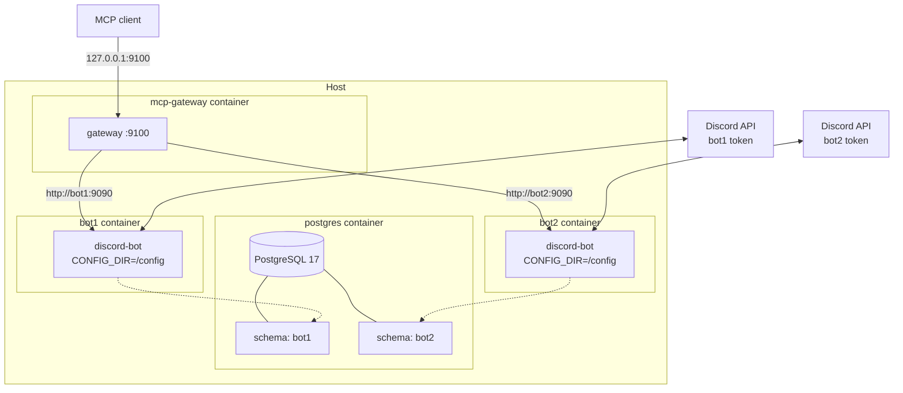

# Multi-Instance Deployment

`discord-bot-rs` is designed to run more than one bot side by side
on the same host: different Discord identities, different
personalities, different feature sets, sharing one Postgres server
and one MCP gateway. This page is the operational recipe for adding
a second instance to an already-working single-instance Compose
stack.

The architectural rationale lives in
[Multi-Instance Model](../architecture/multi-instance-model.md). The
gateway routing model is in
[MCP Gateway Routing](../architecture/mcp-gateway-routing.md). This
page assumes both — it focuses on the steps and the gotchas.

## Topology



Two bot containers, each with its own `CONFIG_DIR` and its own
Discord token, sharing one Postgres (each in its own schema), with
the gateway fronting both MCP endpoints. Adding a third bot is the
same pattern, repeated.

## What you are about to do

1. Create a new instance directory under `instances/`.
2. Fill in its `.env` and `config.toml`.
3. Add a second `bot` service to `docker-compose.yml`.
4. Add the new instance to the gateway's `INSTANCES` env var.
5. Restart the stack.

The whole thing is mechanical once you have done it once.

## Step 1: Create the new instance directory

The example directory is the canonical reference. Copy it:

```bash
cp -r instances/example instances/bot2
cp instances/bot2/.env.example instances/bot2/.env
```

`bot2` is just a label. Use whatever name you like — `production`,
`staging`, `community`, the bot's actual name. You will refer to it
in three places (the directory name, the Compose service name, and
the gateway's `INSTANCES` value), and they are easier to keep
straight if they all match.

## Step 2: Fill in `.env`

Open `instances/bot2/.env`. The fields that **must** differ from
your existing instance:

```bash
DISCORD_TOKEN=<token for the new bot user>
CLIENT_ID=<application ID for the new bot>
GUILD_ID=<server ID for whatever guild this instance manages>
DB_SCHEMA=bot2
```

`DB_SCHEMA` is the critical one. **Two instances pointing at the
same `DB_SCHEMA` will fight over the same tables** — picture two
processes both running the unban worker against the same `tempbans`
rows. Pick a unique schema per instance. Matching the directory
name keeps it obvious.

`DATABASE_URL` stays the same — both bots are talking to the same
Postgres, just to different schemas. The bot creates the schema on
first boot if it does not exist.

If you want different AI keys per instance, you can vary
`DEEPSEEK_API_KEY` and `GEMINI_API_KEY` per `.env`. Most operators
use the same keys for both.

## Step 3: Fill in `config.toml`

`instances/bot2/config.toml` is where per-instance behaviour lives:
the bot's display name, the prefix, what features are on, etc. The
example file documents every field. The fields most likely to
differ between instances:

```toml
bot_name = "Bot Two"
command_prefix = "!"

[features]
minecraft = false
auto_role = false
welcome = false
```

Two bots in the same Discord server need **different prefixes**
(otherwise they will both respond to every command). Two bots in
different guilds can share the same prefix without conflict.

`personality.txt` is loaded at startup as the AI chat system
prompt. Edit it to give the new bot its own voice, or leave the
example default to start.

## Step 4: Add the second `bot` service

Open `docker-compose.yml`. The single `bot` block currently looks
like:

```yaml
bot:
  build:
    context: .
    dockerfile: Dockerfile
  restart: unless-stopped
  env_file: ${INSTANCE_DIR:-./instances/example}/.env
  environment:
    CONFIG_DIR: /config
  volumes:
    - ${INSTANCE_DIR:-./instances/example}:/config
  tmpfs:
    - /tmp:size=500M
  depends_on:
    postgres:
      condition: service_healthy
  healthcheck:
    test: ["CMD-SHELL", "curl -s -o /dev/null --connect-timeout 2 http://localhost:9090/mcp"]
    interval: 10s
    timeout: 5s
    retries: 12
```

Rename `bot` to `bot1` and add a second block named `bot2`. Replace
the `${INSTANCE_DIR}` interpolation in each block with the actual
hard-coded path — once you are running multiple instances, the
`INSTANCE_DIR` variable is no longer the right knob, since you want
both bots up at once:

```yaml
bot1:
  build:
    context: .
    dockerfile: Dockerfile
  restart: unless-stopped
  env_file: ./instances/bot1/.env
  environment:
    CONFIG_DIR: /config
  volumes:
    - ./instances/bot1:/config
  tmpfs:
    - /tmp:size=500M
  depends_on:
    postgres:
      condition: service_healthy
  healthcheck:
    test: ["CMD-SHELL", "curl -s -o /dev/null --connect-timeout 2 http://localhost:9090/mcp"]
    interval: 10s
    timeout: 5s
    retries: 12

bot2:
  build:
    context: .
    dockerfile: Dockerfile
  restart: unless-stopped
  env_file: ./instances/bot2/.env
  environment:
    CONFIG_DIR: /config
  volumes:
    - ./instances/bot2:/config
  tmpfs:
    - /tmp:size=500M
  depends_on:
    postgres:
      condition: service_healthy
  healthcheck:
    test: ["CMD-SHELL", "curl -s -o /dev/null --connect-timeout 2 http://localhost:9090/mcp"]
    interval: 10s
    timeout: 5s
    retries: 12
```

You will also need to rename your existing `instances/example` (or
whatever your first instance was called) to `instances/bot1`, or
just point the `bot1` block at wherever your first instance
already lives.

A few things you do **not** need to vary between the two services:

- The container's MCP port. Both bots bind their internal MCP
  server to `9090` inside their own container. There is no port
  conflict because each container has its own network namespace —
  `bot1:9090` and `bot2:9090` are different addresses on the
  Compose network. The gateway reaches each by service name.
- The Postgres credentials. They share one database; only the
  schema differs (set in each instance's `.env`).
- The `tmpfs`, `restart`, and health check blocks. Identical
  across instances.

## Step 5: Update the gateway's `INSTANCES`

The gateway's `INSTANCES` env var is the routing table. By default
the Compose file uses a fallback that points at a single backend
called `bot`:

```yaml
INSTANCES: "${INSTANCES:-bot=http://bot:9090}"
```

For multiple bots, override it on the host shell:

```bash
INSTANCES="bot1=http://bot1:9090,bot2=http://bot2:9090" docker compose up -d
```

Or hard-code it in the Compose file:

```yaml
mcp-gateway:
  ...
  environment:
    GATEWAY_PORT: "9100"
    INSTANCES: "bot1=http://bot1:9090,bot2=http://bot2:9090"
    ...
```

The names on the left of `=` are the routing keys MCP clients use
when they want to address a specific bot. The URLs on the right
are how the gateway reaches each backend on the Compose network.
The names should match your service names exactly — the gateway
does not know about Compose, but the URLs (`http://bot1:9090`) are
resolved by Docker's internal DNS using the service names.

You should also widen the `depends_on` block so the gateway waits
for both bots to be healthy:

```yaml
mcp-gateway:
  ...
  depends_on:
    bot1:
      condition: service_healthy
    bot2:
      condition: service_healthy
```

If a bot is unhealthy at gateway startup, the gateway will still
boot but it will log warnings about that backend being unreachable
and the relevant `list_guilds` call will fail until the bot
recovers. The 5-minute background refresh in
[`mcp-gateway/src/main.rs`](https://github.com/MrMcEpic/discord-bot-rs/blob/master/mcp-gateway/src/main.rs)
re-attempts initialisation against any unhealthy backends.

## Step 6: Bring it up

```bash
docker compose up -d
docker compose ps
docker compose logs -f
```

You should see both `bot1` and `bot2` reach the
`Database initialized (schema: bot1)` and
`Database initialized (schema: bot2)` log lines, then connect to
Discord. The gateway should log something like
`Initialized backend bot1` and `Initialized backend bot2`, then
`Refreshed guild map`.

In Discord, both bots should appear as separate users with
separate green dots, in whichever guilds their tokens permit.

## Where things live across instances

| What                            | Per-instance         | Shared                       |
|---------------------------------|----------------------|------------------------------|
| Discord token / identity        | yes                  | —                            |
| Personality text                | yes                  | —                            |
| Feature flags                   | yes                  | —                            |
| Postgres data                   | one schema each      | one server                   |
| MCP catalog                     | one MCP server each  | one gateway in front of all  |
| Music / game / rate-limit state | yes (in-memory)      | —                            |
| Host network / disk / CPU       | —                    | shared host                  |

What this means in practice: you can drop `bot2`'s schema with
`DROP SCHEMA "bot2" CASCADE;` without touching `bot1`. You can
restart `bot1` without affecting `bot2`. You can remove the
`bot2` service from Compose and the rest of the stack keeps
working. There is no in-memory cross-talk between processes — each
bot is its own Tokio runtime.

What does **not** work, by design: there is no built-in way for one
bot to send a message to a channel that only the other bot can post
in, no shared music queue, no cross-instance rate limit. If you
need any of that, you build it through the MCP gateway or an
external message bus.

## Adding instances three through N

The same recipe scales. For a third bot:

1. Copy the directory: `cp -r instances/bot2 instances/bot3`
2. Update `.env` (token, client ID, guild, schema)
3. Update `config.toml`
4. Add a third service block to `docker-compose.yml`, named `bot3`
5. Append `,bot3=http://bot3:9090` to `INSTANCES`
6. Add `bot3: condition: service_healthy` to the gateway's
   `depends_on`
7. `docker compose up -d`

In practice, somewhere around 5–10 bots on one host you start
wanting to template the Compose file (Helm, Jsonnet, Make, a small
Python script — anything that turns the per-instance variation
into data). The bot's design tolerates it; the YAML repetition is
just tedious.

## Resource sharing

Each bot process uses 50–150 MB of RAM at idle and bursts during
music playback. CPU is mostly idle outside of voice transcoding.
Postgres handles everything in stride. On a 2 GB / 1 vCPU VPS you
can comfortably run 4–6 bot instances; the bottleneck is RAM, not
CPU. If you want to cap any individual bot's resource use, add a
`deploy.resources` block to its service in Compose.

## Cross-references

- [Multi-Instance Model](../architecture/multi-instance-model.md) —
  the conceptual model the recipe implements.
- [MCP Gateway Routing](../architecture/mcp-gateway-routing.md) —
  how the gateway picks a backend and stays in sync.
- [Multiple Instances](../configuration/multiple-instances.md) —
  the configuration-side walkthrough.
- [PostgreSQL Setup](postgres-setup.md) — schema isolation and
  per-schema backups.
- [Docker Compose](docker-compose.md) — what each service block
  means in detail.
